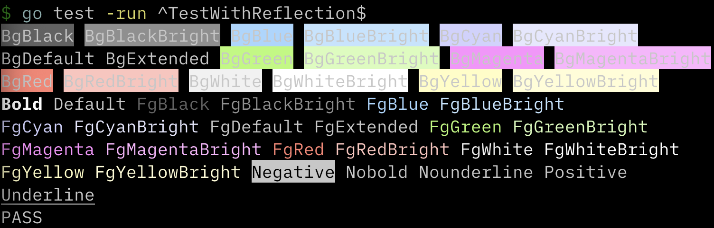

# gocolor



A tiny cross-platform terminal color library that supports enabling and disabling colors.

Uses colors from https://docs.microsoft.com/en-us/windows/console/console-virtual-terminal-sequences?redirectedfrom=MSDN#text-formatting

Tested on MacOS and (occasionally) on Ubuntu 20 and Windows 10.

## Usage

```go
color, err := gocolor.Prepare(true)
if err != nil {
  panic(err)
}

fmt.Println(
  color.Add(color.FgRed, "FgRed"),
  color.Add(color.FgCyanBright+color.Negative, "FgCyanBright+Negative"),
)
```

See [tests](./gocolor_test.go) for inspiration.

I use [mattn/go-isatty](https://github.com/mattn/go-isatty) to test my programs before enabling this.

## Inspirations

- https://github.com/TwiN/go-color (API inspiration)
- https://github.com/bbkane/go-color (my - now deprecated - fork of TwiN/go-color)
- https://github.com/fatih/color (color naming)
- https://github.com/jedib0t/go-pretty (Windows code)

